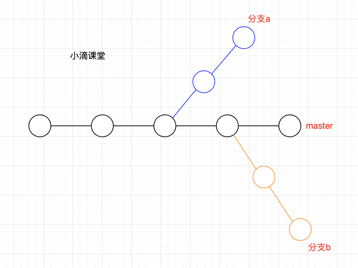
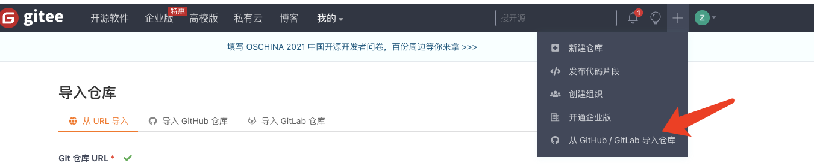

 **愿景："让编程不再难学，让技术与生活更加有趣"  **

**更多课程请访问 xdclass.net**

### 第一章  版本控制Git基础到实战课程介绍

#### 第1集  Git课程介绍和学后水平

**简介：讲解Git课程介绍、学后水平**

- 针对⼈群

  - 前端、后端、大数据等开发同学

    

- 学后水平

  - 掌握Git分布式版本控制工具原理

  - 掌握Git在实际开发中的常用命令

  - 掌握Git分支特性：创建、转换、合并

  - 掌握Git协同开发代码合并冲突解决

  - 掌握代码提交远程仓库托管协作

    


- 学习形式

  - 视频讲解+文字笔记+代码分析+交互流程图

  - 配套源码 + 笔记 + 课程软件 + 技术交流群 + 答疑

    

    

    

    ​                                                                 


 **愿景："让编程不再难学，让技术与生活更加有趣"  **

**更多课程请访问 xdclass.net**

### 第二章 分布式版本控制系统Git概述

#### 第1集 分布式版本控制系统Git介绍

**简介：讲解分布式版本控制系统Git**

- 版本控制定义

  - 记录和跟踪项目中各文件内容的改动变化

  - 保存项目的版本历史，以及改动原因，从而让用户能够查看各个历史版本

  - 版本控制系统也是帮助人员进行协作开发的利器

    

    

- 为什么需要版本控制工具

  - 在公司的日常项目开发中，绝不是单打独斗而是团队协作
  - 随着项目开发积累，越来越多的项目需要归档整理

  

  

  

  

  


#### 第2集 深入理解两种版本控制工具

**简介：讲解两种版本控制工具**

- 集中式版本控制工具

  - SVN

    - 定义

      版本库是集中放在中央服务器的，而开发的时候，用的都是自己的电脑，所以首先要从中央服务器哪里得到最新的版本，然后更改，完成后，需要把自己做的更改推送到中央服务器。集中式版本控制系统是必须联网才能工作，如果在局域网还可以，带宽够大，速度够快，如果在互联网下，网速慢的话，传输非常慢

    - 缺点
      - 服务器单点故障时无法更新版本
      - 容错性差（中央服务器磁盘损坏时全部数据将丢失，只剩各个电脑上的单独快照也就是更改记录）

- 分布式版本控制工具

  - git

    - 定义

      没有中央服务器，每个人的电脑就是一个完整的版本库，这样开发的时候就不需要联网了，因为版本都是在自己的电脑上。既然每个人的电脑都有一个完整的版本库，那多个人如何协作呢？比如说自己在电脑上改了文件A，其他人也在电脑上改了文件A，这时，你们两之间只需把各自的修改推送到代码托管中心gitee（国内）、github、gitlab，就可以互相看到对方的修改了

    - 优点

      - 断网情况下，也可以进行版本控制（本地仓库）

      - 每个客户端保存的都是完整的项目（包含历史记录，更加安全）

        

        

        

    


#### 第3集 Git工作机制和代码托管中心

**简介：讲解Git工作机制和代码托管中心**

- Git工作机制

  

- 代码托管中心

  - 定义

    代码托管中心是网络服务器的远程代码仓库，也称为远程仓库

  - GitHub（外网访问）

  - GitLab（局域网访问）

  - Gitee（国内远程仓库） 码云


 **愿景："让编程不再难学，让技术与生活更加有趣"  **

**更多课程请访问 xdclass.net** 

### 第三章 Git安装和常用的命令使用

#### 第1集 详解Git安装

**简介：Git安装**

- 安装

  - mac

    - 通过mac的包管理器Homebrew下载
      下载Homebrew

      ```bash
      /usr/bin/ruby -e "$(curl -fsSL https://cdn.jsdelivr.net/gh/ineo6/homebrew-install/install)"
      ```

    - 下载git

      ```bash
      brew install git
      ```

    - zsh终端设置git命令自动补全功能

      打开.zshrc文件

      ```bash
      vim ~/.zshrc
      ```

      将下行的内容添加到.zshrc文件中，并保存

      ```bash
      autoload -Uz compinit && compinit
      ```

      刷新shell环境

      ```bash
      source ~/.zshrc
      ```

    - bash终端设置git命令自动补全功能

      用 homebrew 安装 bash-completion 软件包

      ```bash
      brew install bash-completion
      ```

      把下面内容添加到你的~/.bash_profile

      ```
      vim ~/.bash_profile
      ```
      
      ```bash
      if [ -f $(brew --prefix)/etc/bash_completion ]; then
          . $(brew --prefix)/etc/bash_completion
      fi
      ```
      
      重启终端
      
      
  
  - window
  
    安装教程：https://www.yuque.com/u1106272/cai80g/skawco


#### 第2集 Git初始化设置

**简介：详解Git初始化设置**

- 设置用户签名（初始化时设置）

  ```bash
  git config --global user.name "dazhao"
  git config --global user.email "1021199182@qq.com"
  ```

- 查看

  ```bash
  git config user.name
  git config user.email
  ```

- 注意

  - 在每一个版本的提交信息上显示，本次提交的作者是谁
  - 首次安装必须设置，否则无法提交代码
  - 跟之后设置gitee账号没关系

  

- 初始化本地仓库

  - 创建一个文件夹

  - 在终端中进入这个文件夹

    ```bash
    git init
    ```

  - 查看本地仓库状态

    ```bash
    git status
    ```

    

- 查看修改的作者

  - 安装插件GitLens

  - 在settings.json添加设置

    ```json
    "git.path": "D:/Program Files/Git/mingw64/bin/git.exe",
    "editor.renameOnType": true,
    ```

  - 重启vscode


#### 第3集 添加暂存区

**简介：将新增的代码添加暂存区**

- 添加暂存区

  ```bash
  git add .
  ```

- 从暂存区中删除文件（在工作区还是保存着这个文件）

  ```bash
  git rm --cached xxx
  ```


#### 第4集 提交本地仓库

**简介：将新增的代码提交本地仓库**

- 提交本地仓库

  ```bash
  git commit -m "本次修改的信息"
  ```

- 查看版本提交历史信息

  ```bash
  git reflog
  a11e09c (HEAD -> master) HEAD@{0}: commit (initial): 1
  ```

  查看详细的日志信息

  ```bash
  git log
  ```

  


#### 第5集 修改代码后在终端、vscode中的提交

**简介：演示代码更新后的提交**

- 终端

  - 修改代码

  - 添加暂存区

  - 提交本地仓库

- 如何在编辑器vscode提交

  - 更加快捷方便

  


#### 第6集 版本历史回滚

**简介：版本历史回滚**

- 查看历史版本信息

  ```bash
  git reflog
  ```

- 选择要回滚的版本号

  ```bash
  git reset --hard  xxxxxxx
  ```

  


 **愿景："让编程不再难学，让技术与生活更加有趣"  **

**更多课程请访问 xdclass.net**

### 第四章 Git分支的操作

#### 第1集 Git分支的概述和特点

**简介：Git分支的概述和特点**

- 公司开发流程

  

- 分支

  - 

    

  - 特点

    - 同时并行推进多个功能开发，提高开发效率
    - 各个分支在开发过程中，如果某一个分支开发失败，不会对其他分支有任何影响。失败的分支删除重新开发即可


#### 第2集 详解分支的基本操作

**简介：详解分支的基本操作**

- 创建分支

  ```bash
  git branch 分支名 
  
  注意：此时新分支是复制当前所在的分支
  ```

- 查看分支

  ```bash
  git branch 
  ```

- 切换分支

  ```bash
  git checkout 目标分支
  
  注意：切换分支前需将当前分支的修改提交仓库
  ```

- 删除分支

  ```bash
  git branch -d 分支名
  ```

  强制删除

  ```bash
  git branch -D 分支名 
  ```

  


#### 第3集 掌握分支的团队协作—合并

**简介：掌握分支的团队协作—合并**

- 合并分支

  ```bash
  git merge 源分支
  ```

- 合并冲突
  - 当两个分支修改同一文件代码时合并会发生冲突
  - 选择要保存下来的修改重新提交


 **愿景："让编程不再难学，让技术与生活更加有趣"  **

**更多课程请访问 xdclass.net**

### 第五章 代码托管Gitee（码云）

#### 第1集 代码托管中心作用和创建远程仓库

**简介：详解码云上创建远程仓库**

- 代码托管中心

  

- 创建gitee（码云）远程仓库

  - 注册账号
  - 创建远程仓库


#### 第2集 本地连接远程仓库

**简介：本地连接远程仓库**

- 本地连接远程仓库

  - 确保当前分支代码已经干净

    ```bash
    git remote add origin https://gitee.com/wen_zhao/xdclass.git
    ```

  - 验证账户密码(gitee账号密码)

  - 将本地仓库push远程仓库

    ```bash
    git pull origin master --allow-unrelated-histories
    
    git push -u origin master
    ```

  - 本地覆盖线上仓库

    ```bash
    git push -f origin master   
    ```


- 无本地仓库直接拉取

  - https方式

    - 没有验证账号密码时，需要验证

      ```bash
      git clone https://gitee.com/wen_zhao/xdclass.git
      ```

  - ssh方式

    - 生成本地电脑公钥

      ```bash
      ssh-keygen -t ed25519 -C "xxx" 
      ```

    - 查看公钥

      ```bash
      cat ~/.ssh/id_ed25519.pub 
      ```

    - 在远程仓库中添加

      

    - 克隆仓库到本地

      ```bash
      git clone git@gitee.com:wen_zhao/xdclass.git
      ```


#### 第3集 连接远程仓库后的操作

**简介：连接远程仓库后的操作**

- 拉取代码

  ```bash
  git pull 
  ```

- 推送新分支/代码

  ```bash
  git push
  ```

- 指定远程分支复制新分支并切换

  ```bash
  git checkout -b daily/0.0.3 origin/daily/0.0.2
  ```


#### 第4集 码云同步GitHub项目代码

**简介：详解码云同步GitHub项目代码**

- 步骤

  - 进入导入

  

  - 粘贴地址开始导入


- 更新同步

  

  


 **愿景："让编程不再难学，让技术与生活更加有趣"  **

**更多课程请访问 xdclass.net**

### 第六章 大厂团队的开发流程

#### 第1集 一个项目从需求到上线

- 业务、运营按照需求模板提交需求给产品经理
- 产品经理整理好需求列表，确认对应需求的负责人、评审时间点等
- 产品经理发布评审时间通过邮件或者团队群聊通知
- 评审会确定好各个负责任务的时间周期后，产品经理将需求的原型上传发/蓝湖给UI，以及整理好数据埋点
- UI负责页面的切图，完成后发给前端工程师进行页面开发
- 前端开发静态页面的同时，需要与后端工程师进行接口协议的确认，实现前端后端同时开发
- 前端实现模拟数据动态渲染和后端接口开发完成后，进行前后端联调（接口数据的调通）
- 开发自测ok后，前后端同时将代码部署到测试环境
- 测试岗位开发测试，将出现的bug提交给对应的负责人
- 测试通过后，部署到预发环境
- 产品、测试、开发在预发环境确认无误之后部署上线，搞定


### 第七章 GITHUB

#### 第一集 查看当前git 项目连接信息

```
git remote -v
```

#### 第二集 修改git项目 远程连接

```
git remote set-url origin git@github.com:shiwen828828/InternetArchitect.git   
```

#### 第三集 修改git项目 远程连接

```
git remote add origin git@github.com:shiwen828828/InternetArchitect.git
```

